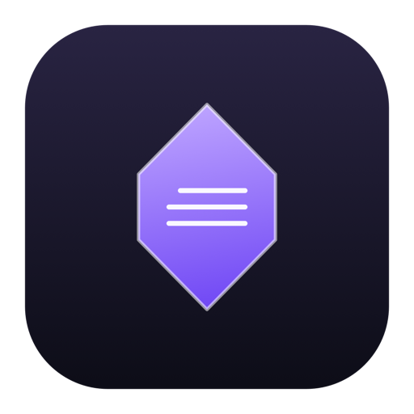
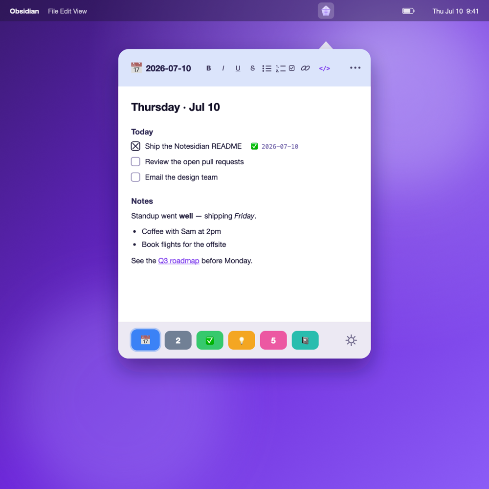
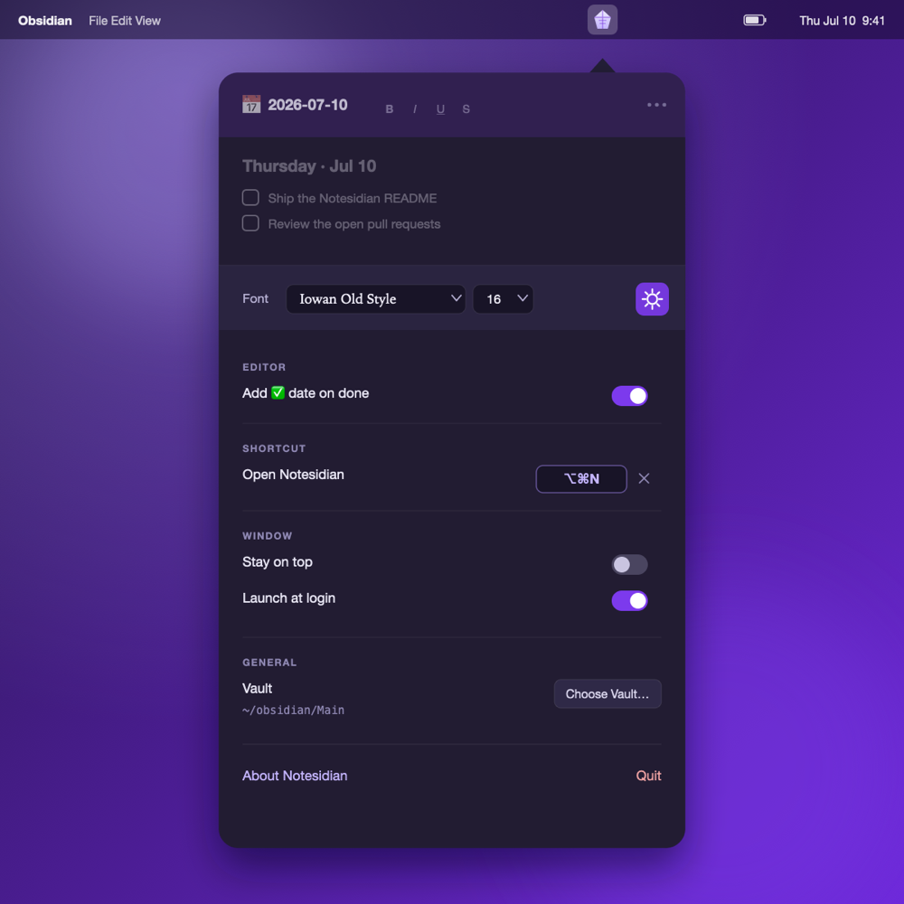

<h1>Notesidian</h1>

**Your Obsidian notes, one keystroke away — right from the menu bar.**

A fast, native macOS menu-bar companion for [Obsidian](https://obsidian.md). Press a
hotkey, jump straight to the notes you touch every day, edit them in a real live-preview
Markdown editor, and get back to work — without ever leaving the app you're in.

[**🐛 Report a bug**](../../issues/new?template=bug_report.yml) &nbsp;·&nbsp;
[**💡 Request a feature**](../../issues/new?template=feature_request.yml) &nbsp;·&nbsp;
[**📋 Browse open issues**](../../issues)

 

<em>Press ⌥⌘N anywhere — your daily note, your tasks, and six quick tabs, right where you're working.</em>

---

## Why Notesidian?

Obsidian is where your knowledge lives — but opening the whole app just to jot a line into
your daily note, tick off a task, or glance at your standup list is friction. Notesidian
keeps the handful of notes you actually live in **one hotkey away**, floating above whatever
you're doing.

It's not a replacement for Obsidian. It reads and writes the **exact same Markdown files**
in your vault, so everything you do here shows up in Obsidian instantly — and vice-versa.
Think of it as a fast lane to the notes that matter most.

## A closer look

<em>Everything lives in one panel — pick a reading font, record a global shortcut, turn on launch-at-login. Light or dark, Notesidian follows your system theme.</em>

## Features

|  |  |
|---|---|
| ⚡ **Instant access** | Click the menu-bar crystal or hit the global hotkey (default **⌥⌘N**, rebindable). It zooms open pointing right at the icon, and can **float on top** of every other app, on every Space. |
| 🗂️ **Six quick tabs** | Six fixed, color-coded tabs along the bottom, each bound to a real note in your vault. Switch with **⌘1–⌘6**; hold **⌘** to see the shortcuts light up. |
| 📅 **Today's daily note** | Point any tab at "Today's Note" and it always opens the current day's note, following your Obsidian Daily Notes folder and date format. |
| ✍️ **Real Markdown editor** | Powered by **CodeMirror 6** — the same engine Obsidian uses. Headings, **bold**, *italic*, `code`, lists, quotes, and links render inline while your file stays plain Markdown. Toggle to source view with **`</>`** any time. |
| ✅ **Clickable tasks** | `- [ ]` checkboxes render as real boxes — click to toggle done. Optionally stamp a `✅ YYYY-MM-DD` completion date, matching the Obsidian Tasks format. |
| 🎨 **Icons & color** | Give each tab an icon from 200+ SF Symbols **or any emoji**, searchable by name. |
| 💾 **Autosave, always in sync** | Every keystroke autosaves to the `.md` file, so Obsidian sees it immediately. Edits you make in Obsidian flow back into Notesidian live. |
| ☁️ **Follows you across Macs** | Your tabs and settings sync via iCloud, so your setup is the same on every Mac. |
| 🌓 **Native & tidy** | Real AppKit app, light/dark aware, launches at login, resizes to taste. No Electron, no browser tab, no clutter. |

## Keyboard-first

Notesidian is built to keep your hands on the keys:

| Shortcut | Action |
|---|---|
| **⌥⌘N** | Open / close Notesidian (rebindable) |
| **⌘1** … **⌘6** | Jump to a tab |
| **⌘O** | Change the current tab's note (searchable picker) |
| **⌘B / ⌘I / ⌘U** | Bold · Italic · Underline |
| **⇧⌘X** | Strikethrough |
| **⇧⌘8 / ⇧⌘7 / ⇧⌘L** | Bullet · Numbered · Checklist |
| **⌘K** | Insert / edit link |

## Private by design

Notesidian works entirely on your Mac. It reads and writes only the vault folder you point
it at, makes **no network connections**, and uses no analytics or tracking. Your notes are
yours — they never leave your machine.

## Requirements

- macOS 13 (Ventura) or later
- [Obsidian](https://obsidian.md) with a local vault

## Getting Notesidian

Notesidian is **coming to the Mac App Store.** Watch this repo (**Watch ▸ Releases**) to be
notified the moment it's available.

## This repository

**This repo is the home for Notesidian's issue tracker** — it's how we hear from you. The
app itself is developed privately, but bugs, ideas, and questions all live here in the open.

### Found a bug?

[**Open a bug report →**](../../issues/new?template=bug_report.yml)

The bug template asks for your macOS version, what you expected, what happened, and steps to
reproduce it. Screenshots or a short screen recording help a lot.

### Have an idea?

[**Request a feature →**](../../issues/new?template=feature_request.yml)

Tell us what you're trying to do and why — the more we understand the workflow, the better
we can build for it. Browse [existing requests](../../issues) first and give a 👍 to ones
you'd like to see; it helps us prioritize.

## License & contact

Notesidian is proprietary software. **© 2026 Milkbar Software.** All rights reserved.
See the [Privacy Policy](PRIVACY.md) — short version: nothing is collected.

Questions that don't fit an issue? [Open a discussion or issue](../../issues) and we'll get
back to you.

Made with 🔮 by <strong>Milkbar Software</strong>

